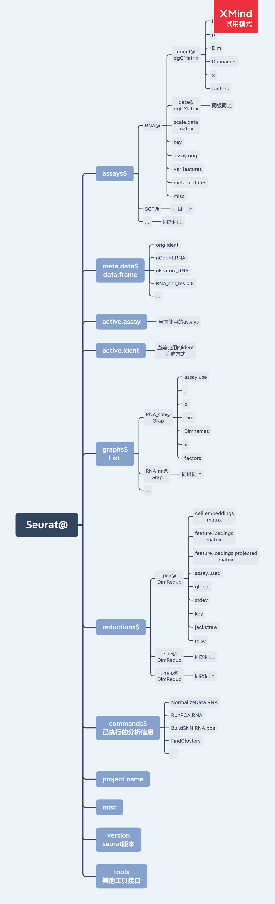

# A introduction to Single Cell Sequening

Based on `singleron02.html`

## data format of Seurat
* Bioconductor主导的SingleCellExperiment数据格式：例如scran、scater、monocle（尽管它的对象不直接使用SingleCellExperiment，但灵感来源于SingleCellExperiment，并且操作也是类似的）
* Seurat：SeuratObject格式
* scanpy：AnnData格式

ref: 

* https://github.com/satijalab/seurat/wiki/Seurat
* https://www.jianshu.com/p/50e289a694d2



## Data Access
Summary information about Seurat objects can be had quickly and easily using standard R functions. Object shape/dimensions can be found using the `dim`, `ncol`, and `nrow` functions; cell and feature names can be found using the `colnames` and `rownames` functions, respectively, or the `dimnames` function. A vector of names of Assay, DimReduc, and Graph objects contained in a Seurat object can be had by using `names`.

Pulling specific Assay, DimReduc, or Graph objects can be done with the double `[[` extract operator. Adding new objects to a Seurat object is also done with the double `[[` extract operator; Seurat will figure out where in the Seurat object a new associated object belongs.

Accessing data from an Seurat object is done with the `GetAssayData` function. Adding expression data to either the counts, data, or scale.data slots can be done with `SetAssayData`. New data must have the same cells in the same order as the current expression data. Data added to counts or data must have the same features as the current expression data.

Cell-level meta data can be accessed with the single `[[` extract operator or using the `$` sigil. Pulling with the `$` sigil means only one bit of meta data can be pulled at a time, though tab-autocompletion has been enabled for it, making it ideal for interactive use. Adding cell-level meta data can be set using the single `[[` extract operator as well, or by using AddMetaData.

The `HVFInfo` function pulls feature mean and dispersion from an Assay object. The vector of variable features can be pulled with the `VariableFeatures` function. `VariableFeatures` can also set the vector of variable features.

A vector of standard deviations for a DimReduc stored within the Seurat object can be found with `Stdev`.

## Methods

```{r Seurat}
library(Seurat)
utils::methods(class = 'Seurat')
```


## test read h5 file.
```{r Read10X_h5}
library("Seurat")


tmp <- Read10X_h5("../covid_balf/GSM4339769_C141_filtered_feature_bc_matrix.h5")


```

## reproduce  UMAP fig 1a

paper "Single-cell landscape of bronchoalveolar immune cells in patients with COVID-19"

```{r DimPlot}
bm <- readRDS("../covid_balf/nCoV.rds")

p1 <- DimPlot(bm, reduction="umap", label = TRUE, repel = TRUE, label.size = 2.5) + NoLegend()
p2 <- DimPlot(bm, group.by = 'group', label = TRUE, repel = TRUE, label.size = 2.5)
p1 + p2

```

## sessionInfo
```{r}
sessionInfo()
```